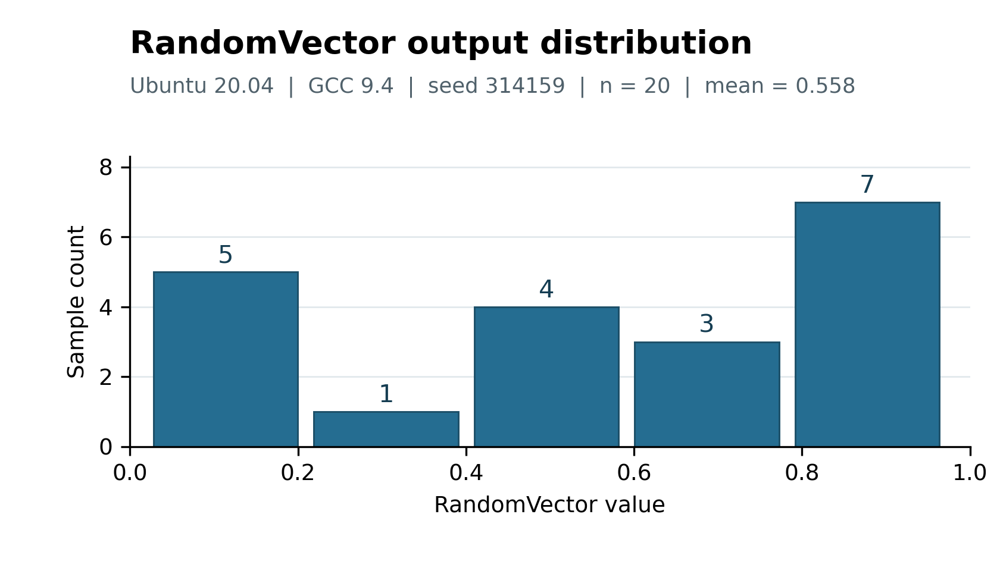

# Robot Lab 1: Linux, Shell, Git, and C++

This repository contains the completed code and reproducible output for the [MIT VNAV Lab 1 exercises](https://vnav.mit.edu/labs_2023/lab1/exercises.html), used here as a learning reference. It is a public code release, not a submission to MIT's private course organization.

## Results

- `dante.txt`: 19,567 lines, 97,676 words, and 14,338 nonblank lines under `en_US.UTF-8`.
- Five `fortune` outputs were appended to `fortunes.txt`.
- A real Git merge conflict was resolved; the commit history is saved in `evidence/git_demo_history.bundle`.
- `RandomVector` compiled with GCC 9.4.0 using both CMake and `g++ -std=c++11 -Wall -pedantic`. CTest passed 1/1 tests.
- With seed 314159 and 20 samples, the mean was 0.55804, the minimum was 0.0278694, and the maximum was 0.982655.

The commands ran in an official Ubuntu Base 20.04.5 chroot on an Ubuntu 22.04.3 cloud host. This uses Ubuntu 20.04 user-space tools and the host's kernel. The original text's SHA-256 is `1CD578E12A35C885028C64EE6C6B3EE1643BE9DD8E45E0A9FBFA77ACB2F6C279`.

## Build and run

```bash
cmake -S RandomVector -B RandomVector/build
cmake --build RandomVector/build
ctest --test-dir RandomVector/build --output-on-failure
RandomVector/build/random_vector
```

On Ubuntu, install `build-essential`, `cmake`, `fortune-mod`, `fortunes-min`, and `locales`, generate `en_US.UTF-8`, then run `LC_ALL=en_US.UTF-8 bash run_on_ubuntu.sh`. The script regenerates `fortunes.txt`. To replay the Git conflict in a fresh checkout, run `bash run_git_demo_ubuntu.sh`; it creates `git_demo_ubuntu/` and does not overwrite an existing directory.

The saved run logs and Git conflict files are in `evidence/`. To inspect the original merge history, run `git clone evidence/git_demo_history.bundle git-demo-review`.

## Visualization



The plot uses the 20 observed values from `evidence/direct_compile_result.txt`. Bin counts are **5, 1, 4, 3, 7**; the mean appears above the plot. Download the [PNG](figures/random_vector_histogram.png), [editable SVG](figures/random_vector_histogram.svg), or [sample CSV](figures/random_vector_samples.csv). To regenerate the figure, install `numpy` and `matplotlib`, then run `python make_histogram.py`.

The `RandomVector` starter files were obtained from [MIT-SPARK/VNAV-labs](https://github.com/MIT-SPARK/VNAV-labs/tree/master/lab1). Experimental changes, test code, scripts, and visualization are included here.
